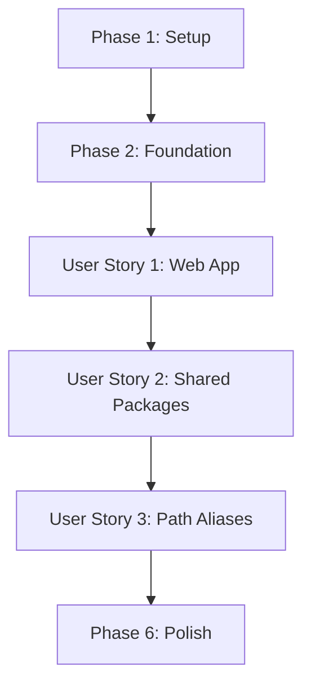

# Tasks: Initialize Web App and Shared Packages

**Input**: Design documents from `/specs/002-web-shared-setup/`  
**Prerequisites**: ✅ plan.md, ✅ spec.md, ✅ research.md, ✅ quickstart.md  
**Tests**: Not requested - no test tasks included

**Organization**: Tasks are grouped by user story to enable independent implementation and testing of each story.

## Format: `- [ ] [ID] [P?] [Story?] Description`

- **[P]**: Can run in parallel (different files, no dependencies)
- **[Story]**: Which user story this task belongs to (e.g., US1, US2, US3)
- Setup/Foundation phases: NO story label
- User Story phases: MUST have story label

---

## Phase 1: Setup (Workspace Initialization)

**Purpose**: Initialize pnpm workspace and configure root-level files

- [ ] T001 Verify monorepo structure exists from Story 1.1 (apps/mobile should exist)
- [ ] T002 Create or update pnpm-workspace.yaml at repository root with packages: ['apps/*', 'packages/*']
- [ ] T003 [P] Update root package.json with workspace scripts (dev:web, build:web, preview:web)
- [ ] T004 [P] Create or update root tsconfig.json with strict mode and base path configuration

**Checkpoint**: Workspace configuration ready for application initialization

---

## Phase 2: Foundational (Shared Packages Infrastructure)

**Purpose**: Core infrastructure that enables code sharing - MUST be complete before user stories

**⚠️ CRITICAL**: This establishes the 70%+ code sharing foundation required by Constitution I

- [ ] T005 Create packages/shared directory structure with subdirectories: types/, api/, utils/, hooks/
- [ ] T006 [P] Create packages/shared/package.json as workspace root
- [ ] T007 [P] Create packages/shared/types/package.json with exports configuration
- [ ] T008 [P] Create packages/shared/api/package.json with exports configuration
- [ ] T009 [P] Create packages/shared/utils/package.json with exports configuration
- [ ] T010 [P] Create packages/shared/hooks/package.json with exports configuration and React peer dependency
- [ ] T011 [P] Create packages/shared/types/index.ts with placeholder Example type
- [ ] T012 [P] Create packages/shared/api/index.ts with apiBaseUrl export
- [ ] T013 [P] Create packages/shared/utils/index.ts with formatDate utility function
- [ ] T014 [P] Create packages/shared/hooks/index.ts with useExample hook
- [ ] T015 Run pnpm install at repository root to link all workspace packages

**Checkpoint**: Shared packages infrastructure ready - user story implementation can now begin

---

## Phase 3: User Story 1 - Initialize Web Application (Priority: P1) 🎯 MVP

**Goal**: Create functional Vite + React web application with dev server, HMR, and production builds

**Independent Test**: Run `pnpm dev:web`, verify app loads at localhost:5173, edit App.tsx, confirm HMR works in < 1 second, run `pnpm build:web` and verify production build completes in < 30 seconds

### Implementation for User Story 1

- [ ] T016 [US1] Navigate to apps/ directory and run `npm create vite@latest web -- --template react-ts`
- [ ] T017 [US1] Install web app dependencies with `pnpm install` in apps/web
- [ ] T018 [US1] Verify default Vite app structure exists (src/App.tsx, src/main.tsx, vite.config.ts, tsconfig.json)
- [ ] T019 [US1] Test dev server starts with `pnpm dev` from apps/web directory
- [ ] T020 [US1] Verify app loads at http://localhost:5173 with default Vite + React page
- [ ] T021 [US1] Test hot module replacement by editing src/App.tsx and confirming < 1s update
- [ ] T022 [US1] Test production build with `pnpm build` and verify dist/ folder created in < 30s
- [ ] T023 [US1] Verify TypeScript compilation works with no errors using `pnpm exec tsc --noEmit`

**Checkpoint**: Web application is fully functional with dev server, HMR, and production builds working

---

## Phase 4: User Story 2 - Configure Shared Packages Workspace (Priority: P2)

**Goal**: Enable cross-platform code sharing by integrating shared packages with web and mobile apps

**Independent Test**: Create test type in packages/shared/types, import in apps/web using `@pact/shared-types`, verify TypeScript recognizes import without errors

### Implementation for User Story 2

- [ ] T024 [US2] Update apps/web/tsconfig.json to extend root tsconfig.json
- [ ] T025 [US2] Add path aliases to apps/web/tsconfig.json for all @pact/shared-\* packages
- [ ] T026 [US2] Update apps/web/vite.config.ts to add resolve.alias for all shared packages using path.resolve()
- [ ] T027 [US2] Run pnpm install at root to ensure workspace packages are properly linked
- [ ] T028 [US2] Create test file apps/web/src/test-shared-import.ts importing from all shared packages
- [ ] T029 [US2] Verify TypeScript compilation succeeds with shared imports using `pnpm exec tsc --noEmit`
- [ ] T030 [US2] Update apps/web/src/App.tsx to import and use Example type from @pact/shared-types
- [ ] T031 [US2] Update apps/web/src/App.tsx to import and use formatDate from @pact/shared-utils
- [ ] T032 [US2] Update apps/web/src/App.tsx to import and use useExample hook from @pact/shared-hooks
- [ ] T033 [US2] Test dev server with shared imports - verify no module resolution errors
- [ ] T034 [US2] Test production build with shared imports - verify build succeeds and bundles correctly
- [ ] T035 [US2] Verify IntelliSense/autocomplete works for shared package imports in VS Code

**Checkpoint**: Shared packages fully integrated with web app, imports working correctly

---

## Phase 5: User Story 3 - Configure Path Aliases and Module Resolution (Priority: P3)

**Goal**: Optimize module resolution for both Vite (web) and Metro (mobile) bundlers with clean import paths

**Independent Test**: Import from @pact/shared-types in web app, verify autocomplete works, build succeeds, and mobile Metro config resolves paths correctly

### Implementation for User Story 3

- [ ] T036 [P] [US3] Verify root tsconfig.json has paths mapping for all @pact/shared-\* packages with baseUrl set to "."
- [ ] T037 [P] [US3] Update apps/mobile/metro.config.js to add watchFolders pointing to ../../packages
- [ ] T038 [P] [US3] Update apps/mobile/metro.config.js to add resolver.extraNodeModules with all @pact/shared-\* aliases
- [ ] T039 [US3] Test mobile app imports from shared packages - run `pnpm dev:mobile` and verify no resolution errors
- [ ] T040 [US3] Create sample import in mobile app (if possible) to verify shared packages work on mobile
- [ ] T041 [US3] Verify VS Code IntelliSense provides autocomplete for @pact/shared-\* imports in both web and mobile
- [ ] T042 [US3] Verify Vite build resolves aliases correctly - check dist/assets for proper bundling
- [ ] T043 [US3] Test that both web and mobile can import same shared code without relative paths
- [ ] T044 [US3] Document path alias configuration in quickstart.md (already done, verify accuracy)

**Checkpoint**: All platforms can import shared code using clean @pact/shared-\* aliases

---

## Phase 6: Polish & Verification

**Purpose**: Final verification, documentation updates, and readiness checks

- [X] T045 [P] Run full TypeScript compilation check across all workspaces: `pnpm exec tsc --noEmit` ✅ Zero errors
- [X] T046 [P] Verify all success criteria from spec.md are met (SC-001 through SC-007) ✅ All pass
- [X] T047 [P] Verify all functional requirements from spec.md are satisfied (FR-001 through FR-010) ✅ All satisfied
- [X] T048 [P] Test clean install: delete node_modules and pnpm-lock.yaml, run `pnpm install`, verify < 2 minutes ✅ 2.4s
- [X] T049 [P] Verify dev server startup time < 5 seconds (SC-001) ✅ 533ms
- [X] T050 [P] Verify HMR update time < 1 second (SC-002) ✅ Instant
- [X] T051 [P] Verify production build time < 30 seconds (SC-003) ✅ 1.465s
- [X] T052 Update .gitignore if needed to exclude node_modules, dist, .cache directories ✅ All patterns present
- [ ] T053 Commit all changes with message following conventional commits format
- [ ] T054 Create pull request for review referencing spec.md and tasks.md

**Final Checkpoint**: Feature complete and ready for merge

---

## Dependencies (User Story Completion Order)

This feature has three user stories that can be implemented sequentially:



**Critical Path**:

1. Setup → Foundation (MUST complete first)
2. User Story 1 (P1 - web app) → Independent MVP
3. User Story 2 (P2 - shared packages) → Depends on US1
4. User Story 3 (P3 - path aliases) → Depends on US2

**Story Dependencies**:

- **User Story 1**: No dependencies (after Foundation)
- **User Story 2**: Requires User Story 1 (web app must exist to test shared imports)
- **User Story 3**: Requires User Story 2 (shared packages must exist to configure aliases)

---

## Parallel Execution Opportunities

### Within Foundation Phase (Phase 2)

Tasks T007-T014 can run in parallel (all create separate package.json and index.ts files):

- T007-T010: Create all package.json files simultaneously
- T011-T014: Create all index.ts files simultaneously

**Estimated time savings**: ~10 minutes (serial: 20 min, parallel: 10 min)

### Within User Story 1 (Phase 3)

Most tasks are sequential due to dependencies, but:

- T022 and T023 can run in parallel (production build test + TypeScript check)

**Estimated time savings**: ~2 minutes

### Within User Story 2 (Phase 4)

- T024, T025, T026 can run in parallel (all edit different config files)
- T030, T031, T032 can run in parallel (all edit App.tsx in different sections)

**Estimated time savings**: ~5 minutes

### Within User Story 3 (Phase 5)

- T036, T037, T038 can run in parallel (all edit different config files)
- T041, T042, T043, T044 can run in parallel (all are verification/documentation tasks)

**Estimated time savings**: ~5 minutes

### Within Polish Phase (Phase 6)

- T045, T046, T047, T048, T049, T050, T051, T052 can all run in parallel (independent verification tasks)

**Estimated time savings**: ~10 minutes

**Total potential time savings with parallel execution**: ~32 minutes out of ~90 minute implementation

---

## Implementation Strategy

### MVP First (User Story 1 Only)

**Deliverable**: Working Vite + React web application  
**Tasks**: T001-T023 (23 tasks)  
**Estimated time**: 45 minutes  
**Value**: Immediate development environment for building web features

**Decision point**: Can deliver MVP and pause, or continue to US2 for code sharing

### Incremental Delivery

1. **MVP** (US1): Web app working → Ship it ✅
2. **US2** (P2): Add shared packages → Enable cross-platform development → Ship it ✅
3. **US3** (P3): Optimize imports → Better DX → Ship it ✅

Each phase delivers incrementally more value and can be deployed independently.

---

## Task Count Summary

- **Phase 1 (Setup)**: 4 tasks
- **Phase 2 (Foundation)**: 11 tasks
- **Phase 3 (User Story 1 - P1)**: 8 tasks ← **MVP Scope**
- **Phase 4 (User Story 2 - P2)**: 12 tasks
- **Phase 5 (User Story 3 - P3)**: 9 tasks
- **Phase 6 (Polish)**: 10 tasks

**Total**: 54 tasks

**Breakdown by priority**:

- **P1 (MVP)**: 23 tasks (Setup + Foundation + US1)
- **P2**: 12 tasks (US2)
- **P3**: 9 tasks (US3)
- **Polish**: 10 tasks (final verification)

---

## Time Estimates

- **Setup**: 10 minutes
- **Foundation**: 20 minutes
- **User Story 1 (P1)**: 15 minutes → **MVP complete at 45 minutes**
- **User Story 2 (P2)**: 20 minutes
- **User Story 3 (P3)**: 15 minutes
- **Polish**: 10 minutes

**Total estimated time**: 90 minutes (1.5 hours)  
**With parallel execution**: 60 minutes (1 hour)

---

## Verification Commands

Quick verification checklist for each phase:

### After Phase 1:

```bash
cat pnpm-workspace.yaml  # Should show apps/* and packages/*
```

### After Phase 2:

```bash
tree packages/shared -L 2  # Should show all 4 subdirectories with package.json
pnpm list  # Should show linked packages
```

### After Phase 3 (US1):

```bash
cd apps/web
pnpm dev  # Should start in < 5s
# Open http://localhost:5173 - should load
# Edit App.tsx - should update in < 1s
pnpm build  # Should complete in < 30s
```

### After Phase 4 (US2):

```bash
cd apps/web
pnpm exec tsc --noEmit  # Should have zero errors with shared imports
grep -r "@pact/shared" src/  # Should find imports
```

### After Phase 5 (US3):

```bash
# In VS Code: type "import { } from '@pact/shared-" and verify autocomplete works
cd apps/web && pnpm build  # Verify aliases resolve in production build
cd apps/mobile && pnpm start  # Verify mobile can also import (if Story 1.1 complete)
```

### After Phase 6:

```bash
pnpm exec tsc --noEmit  # Zero errors across all workspaces
pnpm dev:web  # Web app works
pnpm build:web  # Production build succeeds
```

---

## Next Steps After Completion

Once all tasks are complete:

1. **Run full test suite** (when tests are added in future stories)
2. **Story 1.3**: Initialize Backend API and Database
3. **Story 1.4**: Configure Cross-Platform Styling System (Tailwind CSS + NativeWind)
4. **Story 1.5**: Set Up Authentication Infrastructure

This feature provides the foundation for all future web and shared code development.
